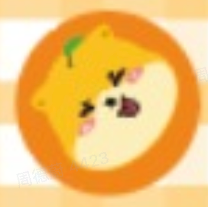
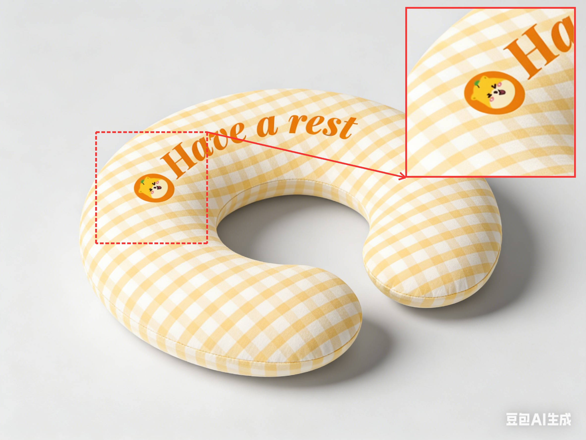
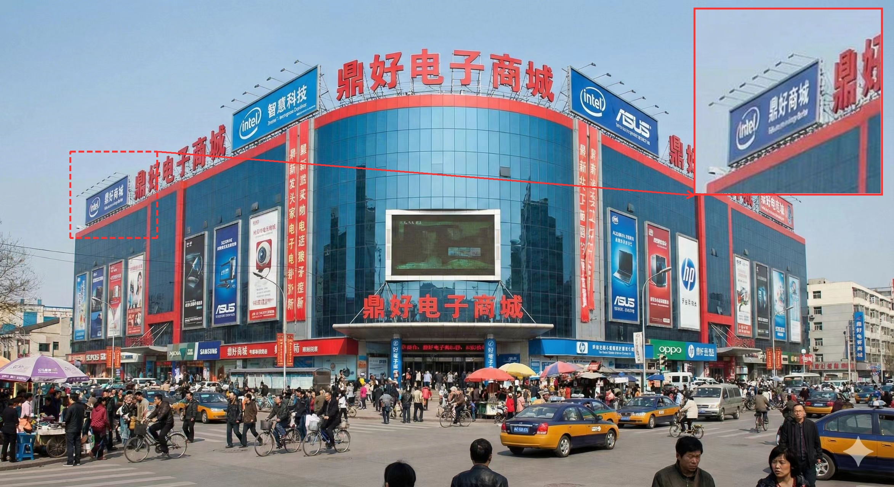

# RefineAnything

**Multimodal Region-Specific Refinement for Perfect Local Details**

<a href="https://limuloo.github.io/RefineAnything/"></a>
<a href="https://arxiv.org/abs/2604.06870"></a>
<a href="https://github.com/limuloo/RefineAnything"></a>
<a href="https://huggingface.co/limuloo1999/RefineAnything"></a>
<a href="https://huggingface.co/spaces/limuloo1999/RefineAnything"></a>

RefineAnything targets **region-specific image refinement**: given an input image and a user-specified region (e.g., scribble mask or bounding box), it restores fine-grained details—text, logos, thin structures—while keeping **all non-edited pixels unchanged**. It supports both **reference-based** and **reference-free** refinement.


---

## News
- **2026-04-12** — Hugging Face Space demo is live: <https://huggingface.co/spaces/limuloo1999/RefineAnything>.
- **2026-04-09** — Checkpoint released on Hugging Face: <https://huggingface.co/limuloo1999/RefineAnything>.
- **2026-04-09** — Release inference scripts.
- **2026-04-08** — Documentation skeleton added; **code release coming this month** (inference scripts, environment, and checkpoints will be linked here).
- **TBD** — Checkpoints and training/evaluation resources will be announced once finalized.

---

## Highlights

- **Region-accurate refinement** — Explicit region cues (scribbles or boxes) steer edits to the target area.
- **Reference-based and reference-free** — Optional reference image for guided local detail recovery.
- **Strict background preservation** — Edits stay inside the target region; training emphasizes seamless boundaries.

---

## Comparisons


---

## Installation

```bash
pip install -r requirement.txt
```

---

## Quick Start

Only **three** things are required to run RefineAnything:

| Argument | Description |
|----------|-------------|
| `--input` | Source image |
| `--mask` | Binary mask (white = region to refine) |
| `--prompt` | What to refine |
| `--ref` | *(optional)* Reference image for guided refinement |

---

### Demo 1 — Reference-based Logo Refinement

Refine a blurry logo on a pillow using a reference image.

```bash
python scripts/fast_inference.py \
    --input  src/input1.png \
    --mask   src/mask1.png \
    --prompt "Refine the LOGO." \
    --ref    src/ref1.png \
    --output output/demo1.png
```

<table>
<tr>
<td align="center"><b>Input</b></td>
<td align="center"><b>Reference</b></td>
<td align="center"><b>Prompt</b></td>
</tr>
<tr>
<td></td>
<td></td>
<td><i>"Refine the LOGO."</i></td>
</tr>
<tr>
<td align="center" colspan="3"><b>Output</b></td>
</tr>
<tr>
<td colspan="3"></td>
</tr>
</table>

---

### Demo 2 — Reference-free Text Refinement

Refine blurry Chinese text on a building sign — no reference image needed.

```bash
python scripts/fast_inference.py \
    --input  src/input2.png \
    --mask   src/mask2.png \
    --prompt "refine the text '鼎好商城'" \
    --output output/demo2.png
```

<table>
<tr>
<td align="center"><b>Input</b></td>
<td align="center"><b>Prompt</b></td>
</tr>
<tr>
<td></td>
<td><i>"refine the text '鼎好商城'"</i></td>
</tr>
<tr>
<td align="center" colspan="2"><b>Output</b></td>
</tr>
<tr>
<td colspan="2"></td>
</tr>
</table>

---

## Citation

If you use this repository, please cite:

```bibtex
@article{zhou2026refineanything,
  title={RefineAnything: Multimodal Region-Specific Refinement for Perfect Local Details},
  author={Zhou, Dewei and Li, You and Yang, Zongxin and Yang, Yi},
  journal={arXiv preprint arXiv:2604.06870},
  year={2026}
}
```

---

## Acknowledgements and License

RefineAnything builds on ideas and components from the broader diffusion and multimodal ecosystem (including **Qwen2.5-VL**, **Qwen-Image**, and latent diffusion with **VAE** + **MMDiT**). Base model weights and API terms are subject to their respective licenses—**verify compliance before redistributing checkpoints or derived weights**.

Repository **code license**: *TBD* (e.g., Apache-2.0 or MIT)—set `LICENSE` when you open-source the implementation.
